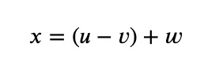
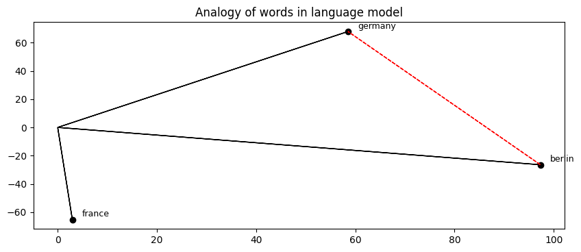
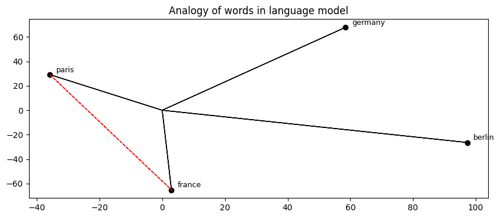
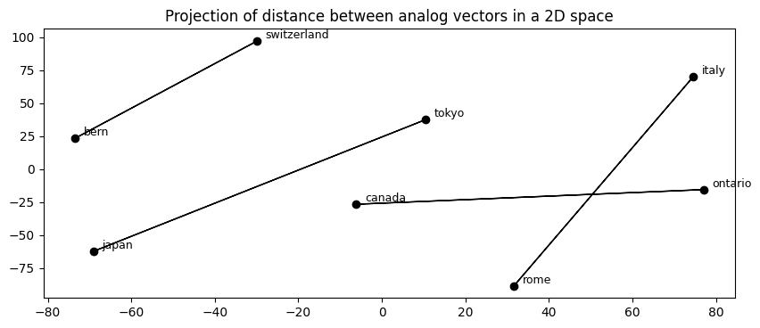
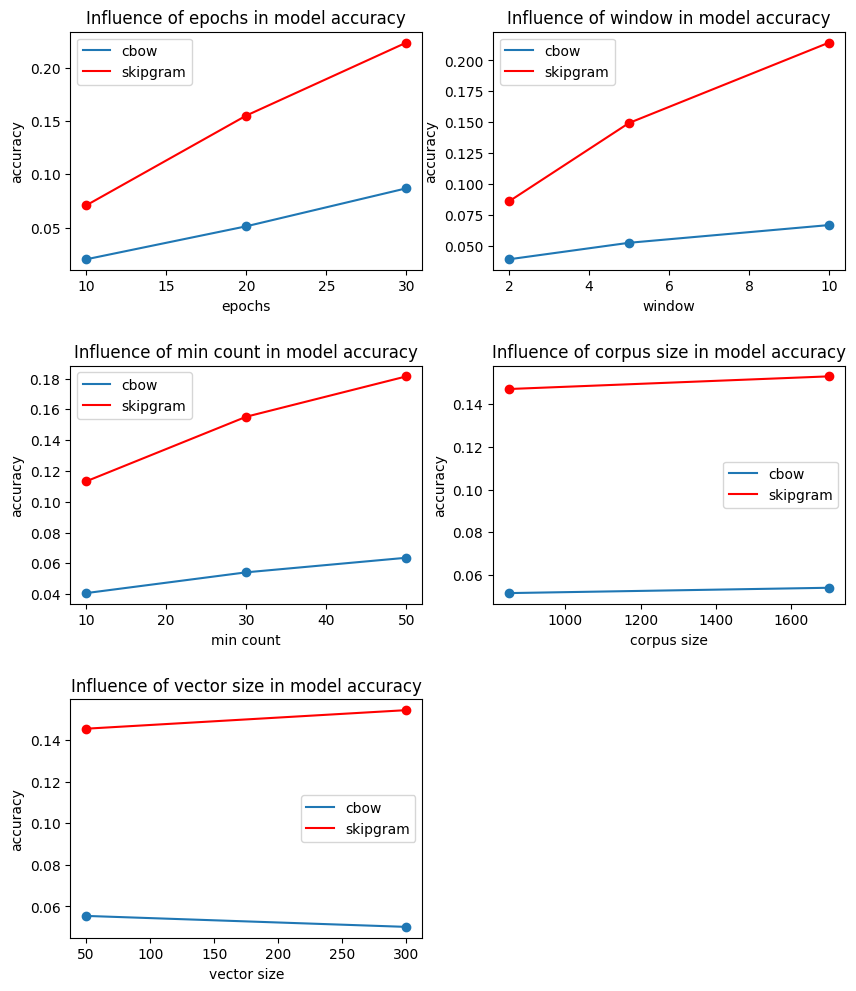
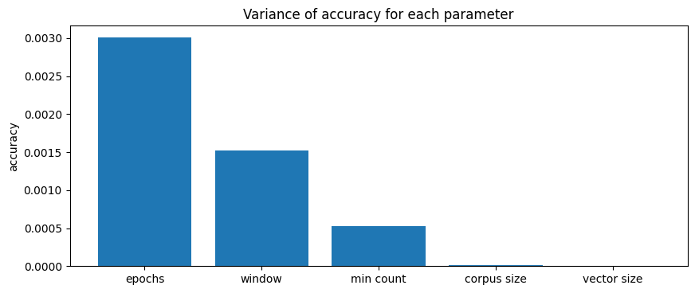

# Natural Language Model

## Word2Vec

The Word2Vec technique is a method for obtaining and word embeding suitable for natural language processing, such as finding synonyms, making analogies and suggesting missing words for a sentence. It uses a neural network to learn from a large text (or corpus) am build a n-dimensional space containing one vector for each word on the training vocabulary.

This technique is relatively recent, being first published by a team of Google researches in 2013. The two main algorithms applied are skipgram and cbow. In both cases, we use a set of hyperparams, such as number of features in the word embeding (or the dimensionality of each word vector), the number of epochs and the size of our context window, to define the way our language model will be trained.

The objective of this notebook, is to explore how the variation of these hyperparameters will affect the accuracy of our model. The following implementation was made using gensim. It covers the training and validation of various models, however, it does not cover any kind of sophisticated text lemmatization, since we are using an already noralized corpus. Needless to say, that is not the real word scenario in most cases, therefore, any pratical implementation of Word2Vec should take this into account.

### Creating and training the language models

We will have a set of 108 combinations of parametres for each algorithm, therefore we will have to train 216 models. Each model takes a few minutes to train so it would be a very time consuming process to run each time. Gladly, gensim allows us to save our models into files, so we only have to train the models once.

### Parameters

For the hyperparameters to be tunned we will have:

1. vector_sizes, wich indicates the number of features in each word embeding of the model
2. windows, which reffers to the size of the context use to evaluate the sentences during training
3. min_counts, which is the number of times a word must apear in the corpus to be present on the vocabulary
4. corpus_sizes, which is the number of sentences from our corpus that will be considered for training
5. the number of epochs performed during training

each one of the parameters will have three values and each value will be evenly permutated generating 108 combinations.

## Analogies
With our model trained, we can query for analog words. Take for example the pair germany and berlin, there is a clear relation between them, so if we were to provide a third word, it is to be expected that the model will return a fourth word bearing the same relation with the third word as the second did to the first, in this case, supose we input the word france, a reasonable answer would be paris, since paris is to france as berlin is to germany.

This is shown bellow:

Code:
```python
model = get_model(corpus_size=len(sentences), sg=1, window=10, vector_size=300, epochs=30, min_count=10)
print('germany is to berlin as france is to: {}'.format(analogy(model, 'germany', 'berlin', 'france')))
print('sun is to star as earth is to: {}'.format(analogy(model, 'sun', 'star', 'earth')))
print('man is to father as woman is to: {}'.format(analogy(model, 'man', 'father', 'woman')))
print('frederick is to king as elizabeth is to: {}'.format(analogy(model, 'frederick', 'king', 'elizabeth')))
print('car is to road as boat is to: {}'.format(analogy(model, 'car', 'road', 'boat')))
print('fast is to faster as easy is to: {}'.format(analogy(model, 'fast', 'faster', 'easy')))
print('small is to big as good is to: {}'.format(analogy(model, 'small', 'big', 'good')))
```
Output:
```
germany is to berlin as france is to: paris
sun is to star as earth is to: planet
man is to father as woman is to: mother
frederick is to king as elizabeth is to: queen
car is to road as boat is to: shore
fast is to faster as easy is to: easier
small is to big as good is to: bad
```

Of course, it does not always work...

Code:
```python
print('hat is to head as shirt is to: {}'.format(analogy(model, 'hat', 'head', 'shirt')))
```

Output:

```
hat is to head as shirt is to: severed
```

And we also have some undesired bias...

Code:
```python
print('man is to doctor as woman is to: {}'.format(analogy(model, 'man', 'doctor', 'woman')))
```

Output:
```
man is to doctor as woman is to: nurse
```

The way this works is that we expect words that share the a same relation will have a similar distance from each other in our embeds. Lets say that each word is represented by an n-dimensional vector, if _u_ is the vector that represents germany, _v_ is the vector for berlin and _w_ is the vector for france, a word that is to france as berlin is to germany would be close to a vector _x_ obtained by:

<p align="center">
  
</p>

This way we can expect that the vector for the word paris would be one of the closest vectors from $x$. This happends on a n-dimensional space, 300-dimensional space in our case, so we can not visualize it properly, however, we can plot a projection of the vectors on an 2-dimensional or 3-dimensional space and have an idea of what it looks like.



On the image above, we can see a 2D representation for the words germany, and france and paris as well as the difference between germany and berlin (in red). Below you can see how we get a vector similar to paris if we deslocate the diference between germany and berlin to france.



You can verify that this behaviour is reproducted for every analog term.



Although we have some divergence on a few cases like canada/ontario, this is mostly due to the fact that we are projecting a 300-dimensional vector on a plane.

We can use this caracteristic to measure the accuracy of our model. Given a collection of pre stablished analogies, we will provide the first three words and search the model's reponse for the fourth. Keep in mind that the output of the model is not a single word as the exemples above, it is an array of probabilities, and each component of the array will be accounted for during the accuracy measure, this will also be done by gensim.

You can see below the best achieved results for each algorithm. Skipgram had a maximum of 36.8% of accuracy rate while cbow only achieved about 13.8% accuracy.

```
Skipgram:
Max accuracy: 0.3687162891046386	Average accuracy: 0.14994445909248685

Cbow:
Max accuracy: 0.1382955771305286	Average accuracy: 0.052833369841598594
```

## Hyperparameter study

With our accuracy data gathered, we can visualize how each paremeter affected the average accuracy obtained on the figures below.



As we can see, for both algorithms the number of the epochs, the size of the context window and the min count had a much greater impact in overall accuracy, while vector size and corpus size created a smaller variation on the results. We can comprove this tendency with the following plot of the variance for each parameter.



Moreover, as the vector size increases, the average accuracy decreases for the cbow algorithm. This could be an indicator of overfitting, as we try to extreact a large number of features from a limited corpus.

With this data, we can prioritize the variation of the most relevant params and set a constant value for the remaining ones. Training new models with that in mind we obtain the results below:

```
Skipgram:
Max accuracy: 0.488209722039257 	Average accuracy: 0.3329544049317867

Cbow:
Max accuracy: 0.2974575154788565	Average accuracy: 0.15081077725330802
```

Now that we know which hyperparameters to tune, not only we got a much faster training, but we also got a hgher average and maximum accuracy. Now all one got to do is to choose which values will better suit each use case. A higher min count will lead to more recise results at the cost of a smaller vocabulary, so some words that are recognized at min_count = 10 could not exist at min_count = 70. In the example below, ou can see how the word feline is present in model A, but is not in model B, so adjust your min count properly according to your corpus size.

Code:
```python
model_a = get_model(corpus_size=len(sentences), sg=1, window=10, vector_size=100, epochs=10, min_count=10)
model_b = get_model(corpus_size=len(sentences), sg=1, window=10, vector_size=100, epochs=10, min_count=70)

word = 'feline'

print('Model A: {}'.format(model_a.most_similar(word)[0][0]))

try:
    print('Model B: {}'.format(model_b.most_similar(word)[0][0]))
    print()
except KeyError:
    print('Model B: feline is not present :(')
```

Output:
```
Model A: felines
Model B: feline is not present :(
```
We could also see how a large vector size can cause overfiting on a smaller corpus especially when using cbow, and how a larger number of epochs can increase accuracy but it also makes training slower.